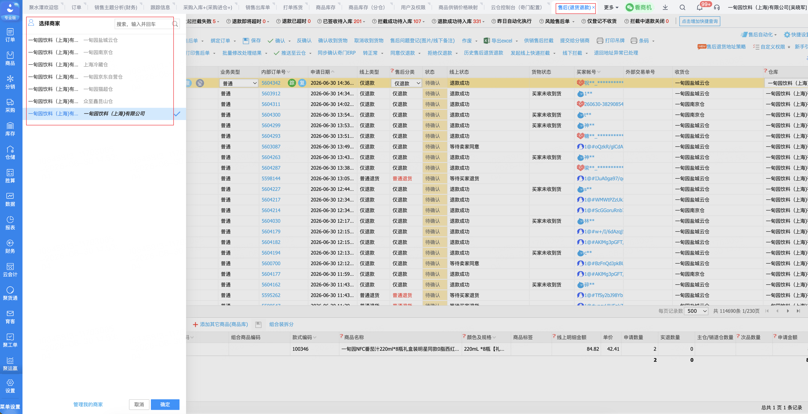
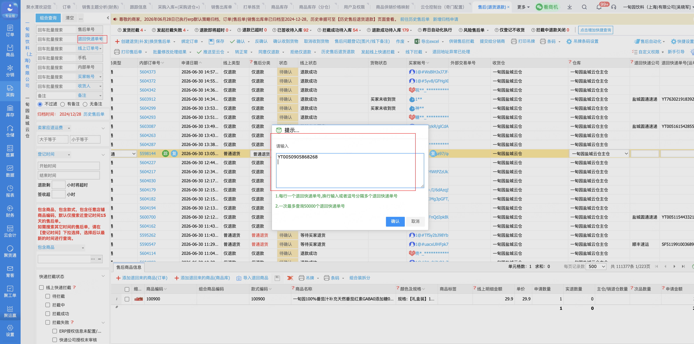
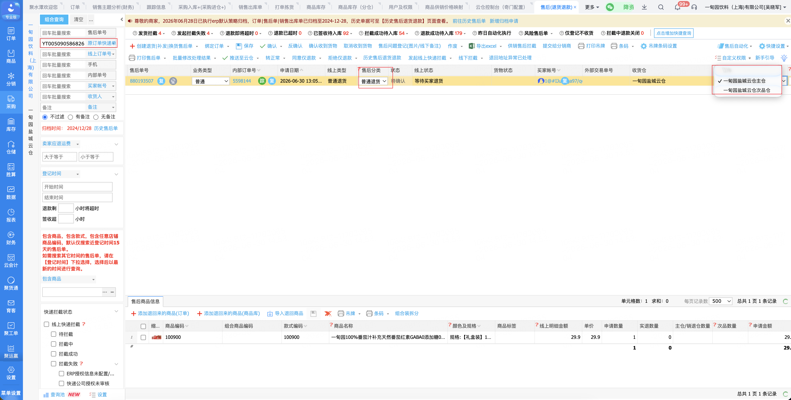
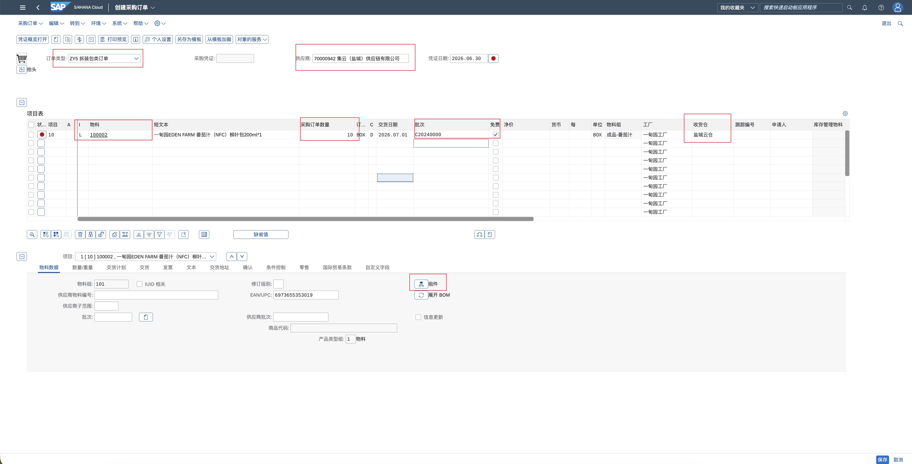
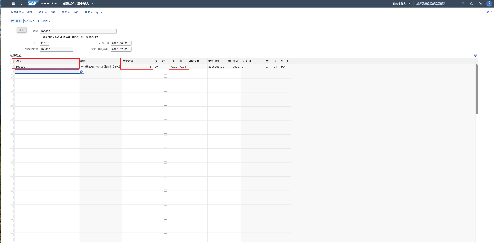
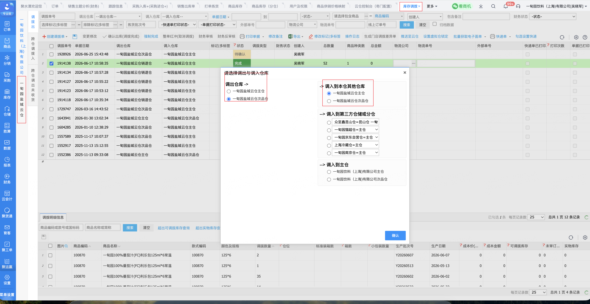
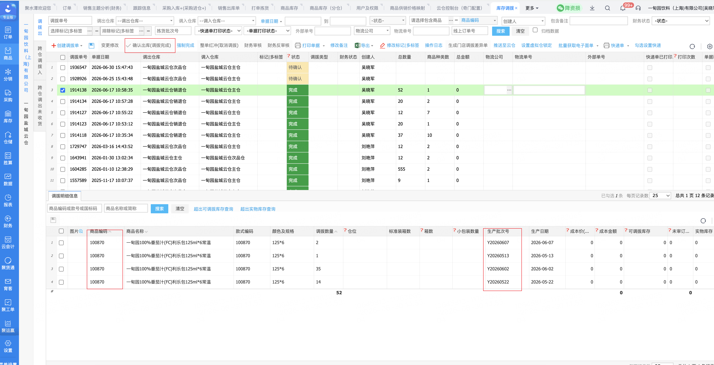
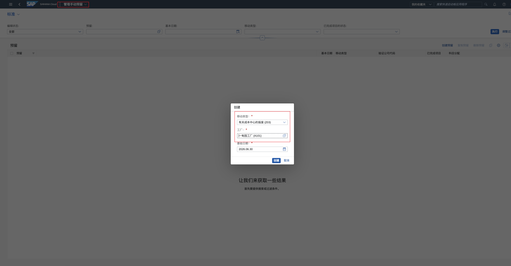
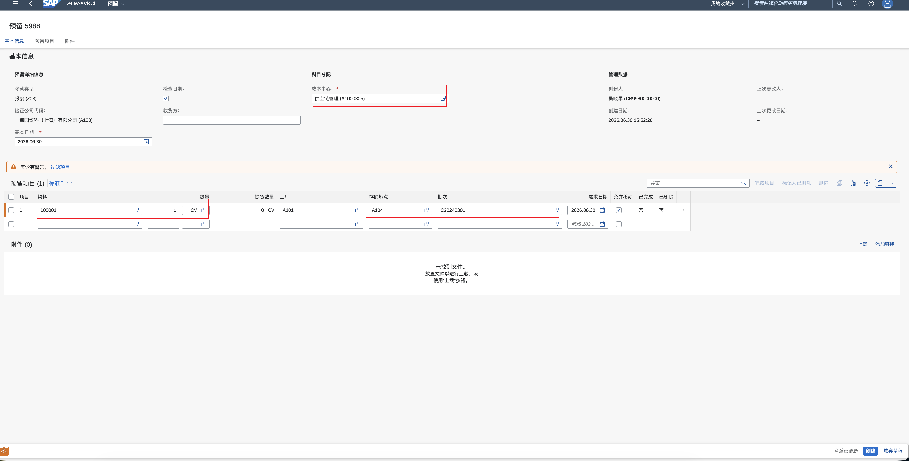
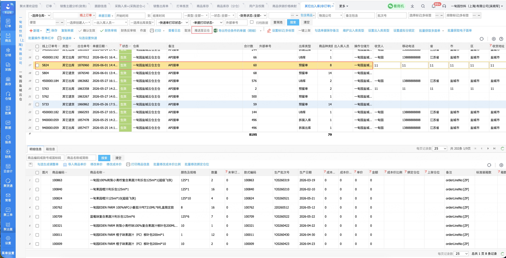

# 仓库库存相关操作

### 线上订单退货：

1. 选择对应仓库，将快递单号批量复制粘贴到退回快递单号中

   

   

2. 如退回快递单号查不到，切换为原快递单号查询

3. 修改售后分类为普通退货，退回仓库选择次品仓

4. 勾选对应售后单，推送至云仓收货

   

### 退货二次处理：如需报废的物料、二次上架的物料

1.需要拆组换编码的：在SAP创建拆组套单据，行物料填组成的产品物料编码，组件填写要拆的产品物料编码，供应商选择对应仓库所属供应商

点组件视图输入物料批次，集中输入视图输入要拆的物料编码+数量+仓位

2.不需要拆组换编码的：直接在聚水潭创建调拨单，从次品仓调入正品仓，填写物料编码+批次，保存后点确认出库后，次品仓物料成功转移到正品仓

3.需要报废的：在SAP创建预留单，移动类型（Z03），成本中心（供应链管理)，输入物料+批次+仓位保存即可。保存后在聚水潭自动生成其它出库单，根据实际情况是否推送云仓进行出库确认

​