## 供应商相关报表查询

APP: 管理业务伙伴主数据 / 管理供应商主数据

在SAP中供应商和客户都属于业务伙伴。

管理业务伙伴主数据/管理供应商主数据 这两个APP风格是一致的，区别在于 “管理业务伙伴主数据”中默认查询供应商和客户，而“管理供应商主数据”中默认展示供应商。

输入查询条件可以按条件查询。

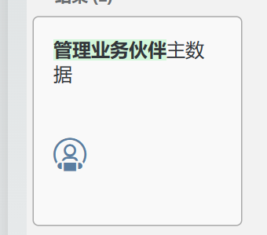

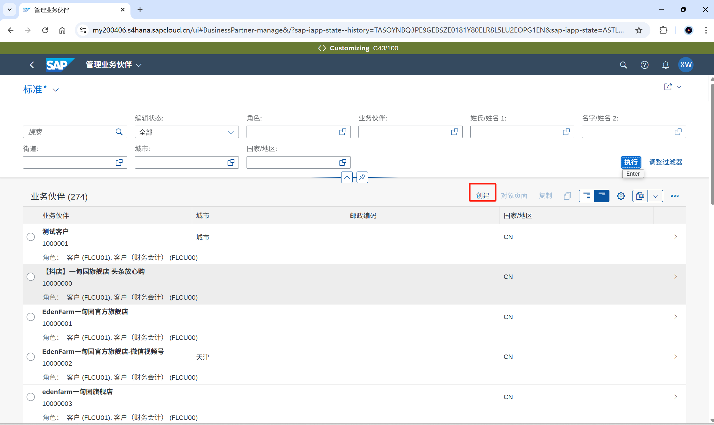

## 创建供应商

APP: 管理供应商主数据/ 维护业务伙伴

这两个APP都可以维护供应商，是两种风格的界面，两个APP中的需要维护的数据是一致的，可以根据自己的需要选择，本操作手册以app”维护业务伙伴”为例。

找到APP, 打开，选择“组织”，

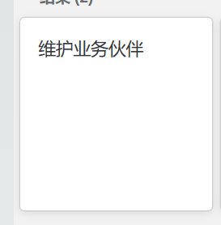

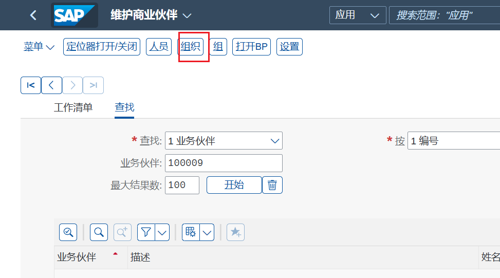

如果是外部指定编号，需要添加业务伙伴编号，选择对应的分组。在地址中填写公司名称和其他信息。

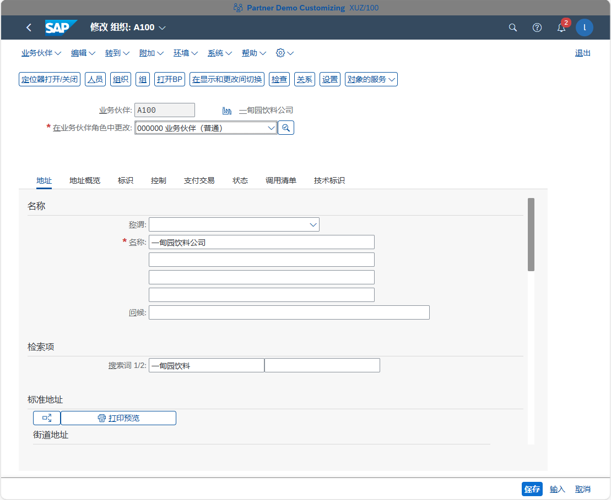

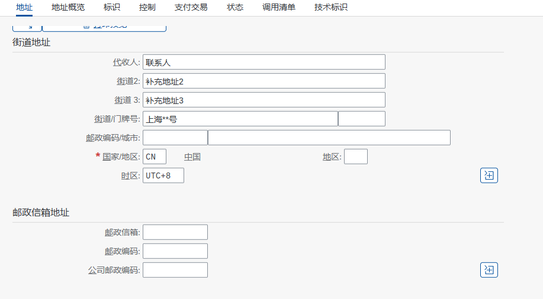

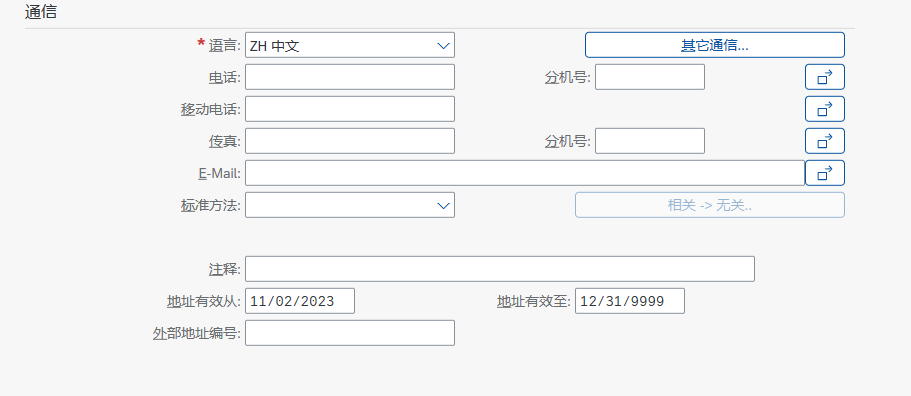

业务伙伴角色：000000业务伙伴（普通）

名称： 供应商的名称

国家：CN表示中国，供应商的国家

地区：JS表示江苏，省份

邮政编码：城市所在地区的邮政编码

城市：供应商所在的城市

街道：供应商所在城市的街道

门牌号：具体的门牌号

语言：ZH表示中文，默认ZH.

填写完成后点击“保存”按钮。

## 为供应商扩展角色

供应商角色中是维护采购组织的，供应商（财务会计）中维护公司代码。

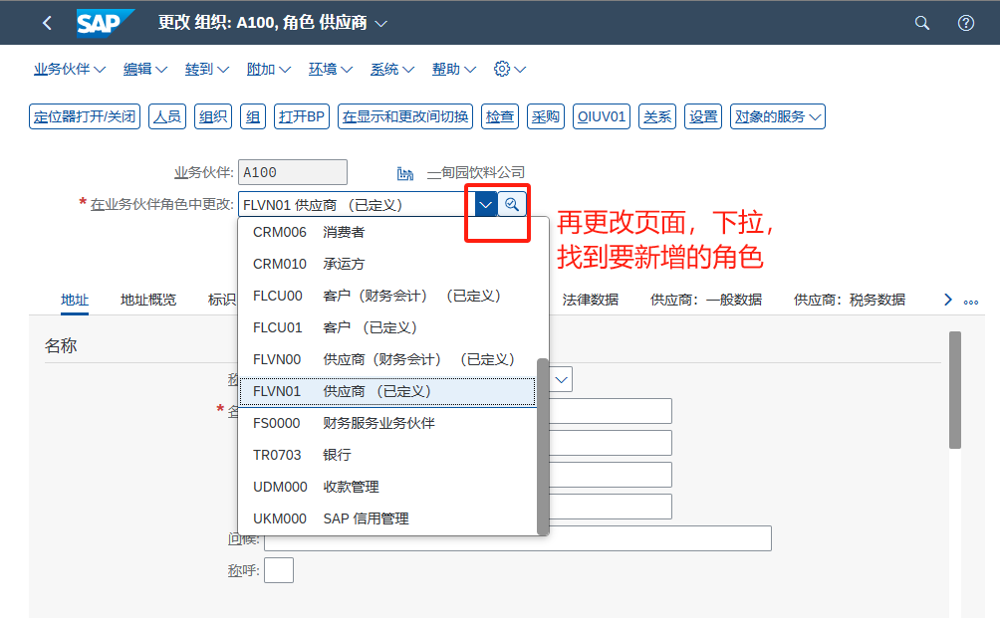

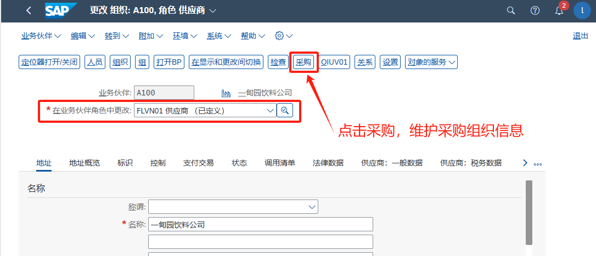

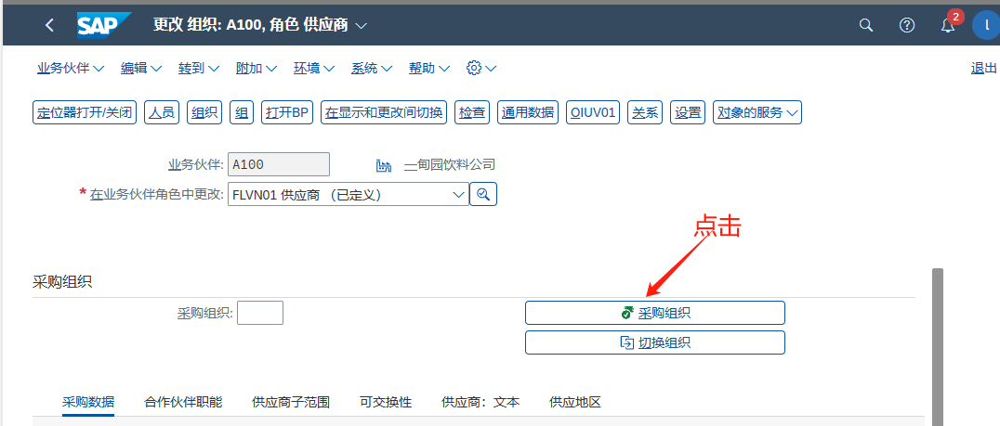

选择要加的采购组织，在没有保存的情况下可以点击“删除“按钮，一旦保存就无法删除，

如果要同时加多个采购组织，可以再次点击“创建“， 创建完之后可以选择要对应的采购组织，点击传输维护详细信息。

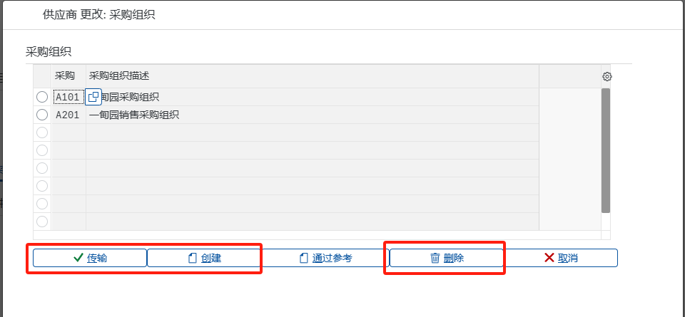

维护货币，付款条件，基于收货的发票校验默认打勾。

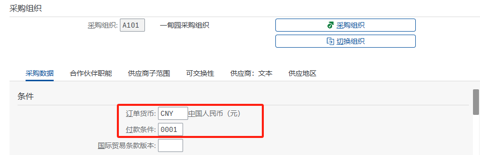

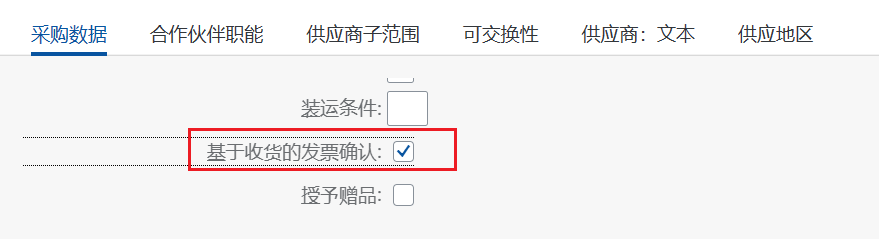

如果有其他的出票方可以在“合作伙伴职能”中维护，前提是这个出票方必须先在系统中维护供应商主数据。

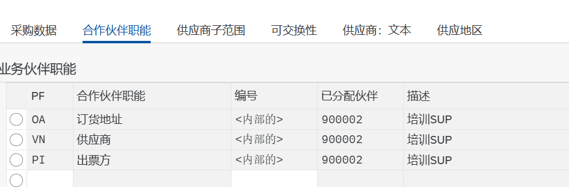

增加“供应商（财务会计）”角色：下拉选择对应的角色

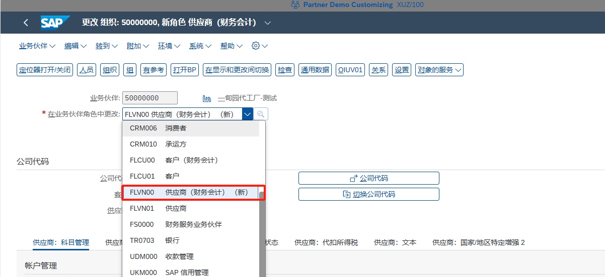

选择“公司代码”， 维护公司代码信息。

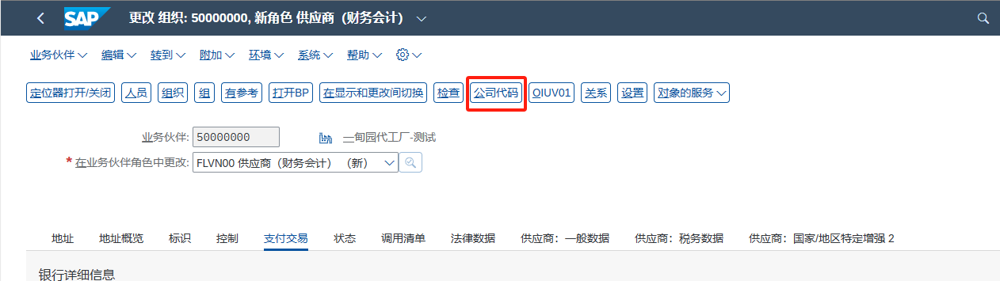

选择“公司代码”，

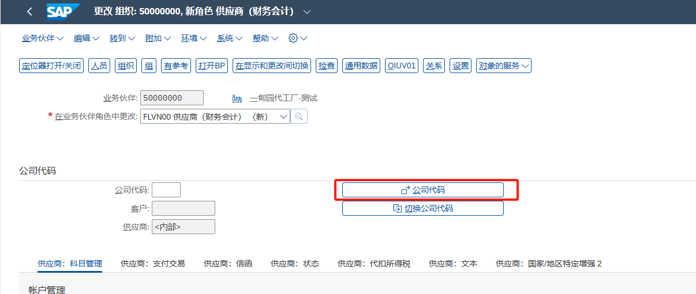

选择要添加的公司代码，回车，选中点击“应用”。

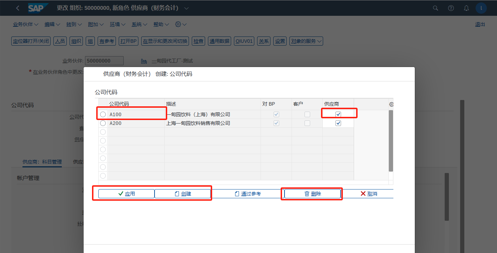

选择对应的科目，

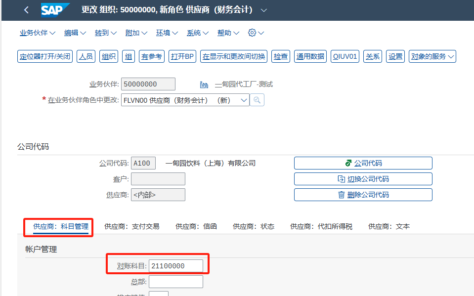

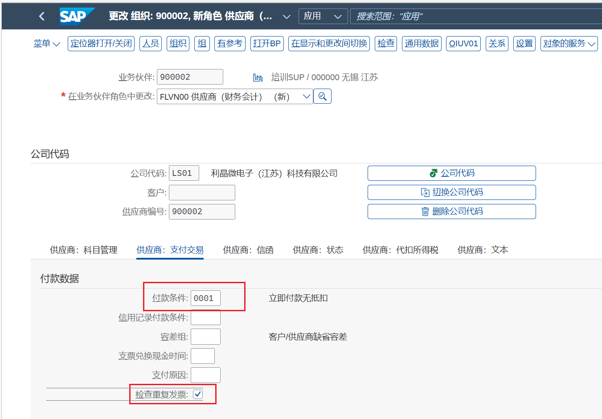

维护完成后，点击“保存”按钮。

## **修改供应商**

打开APP”维护业务伙伴”，

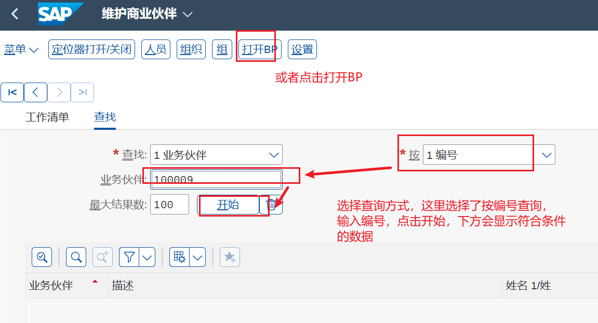

点击“在显示和更改切换”，切换显示和编辑状态，如何编辑和创建相似。

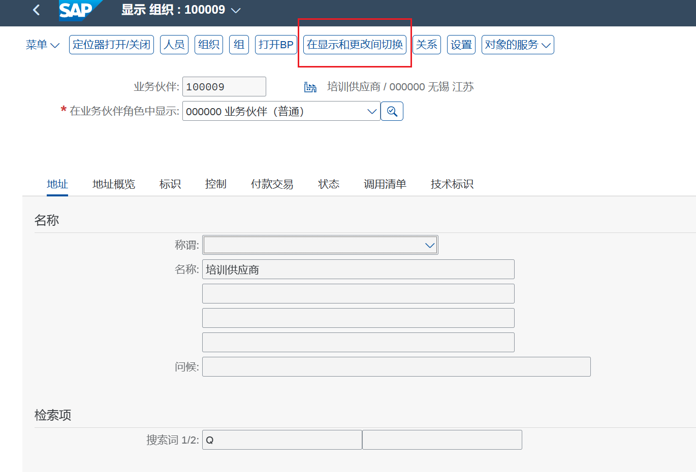
