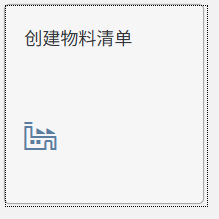
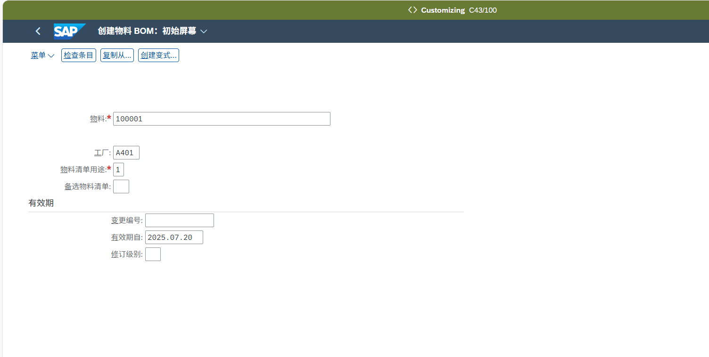
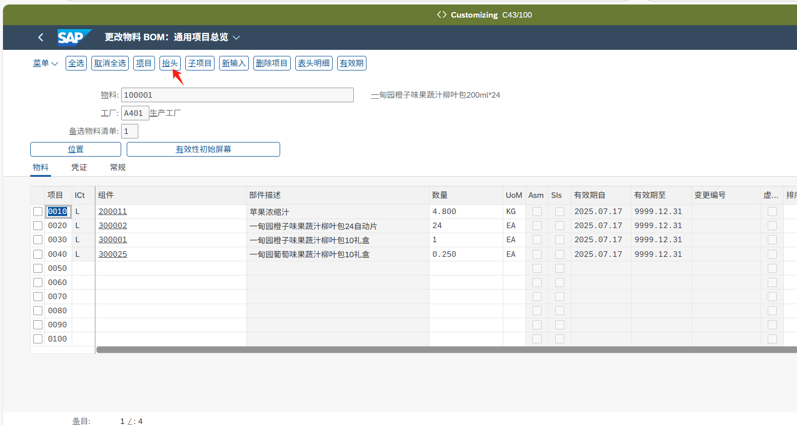
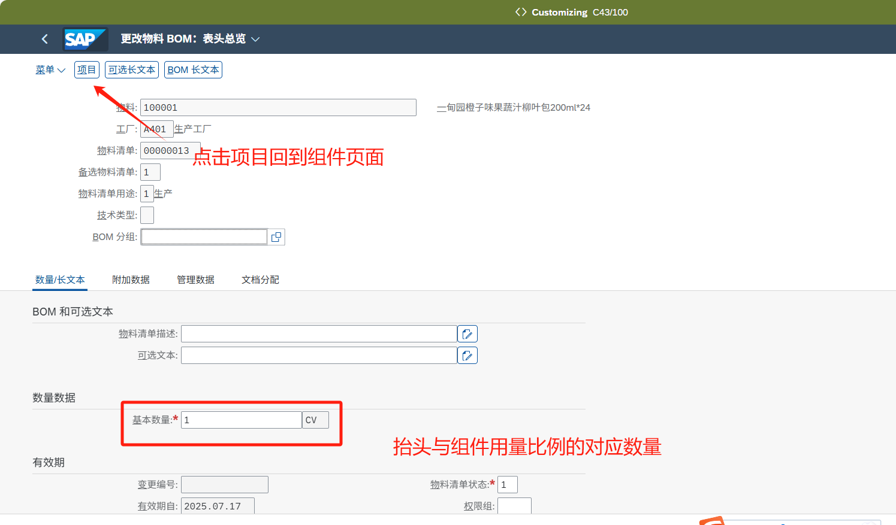
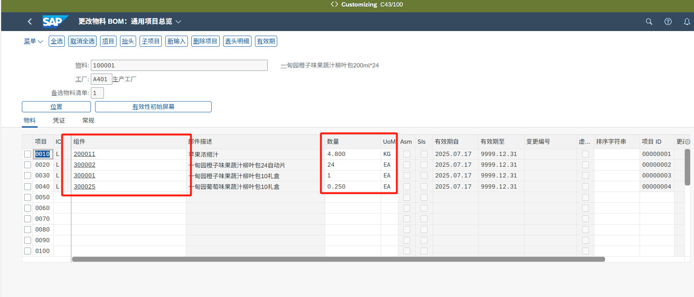
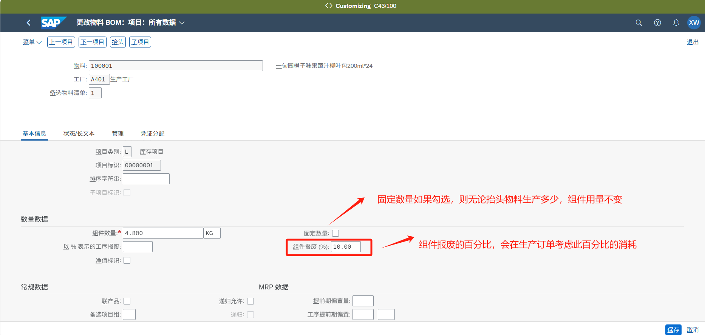
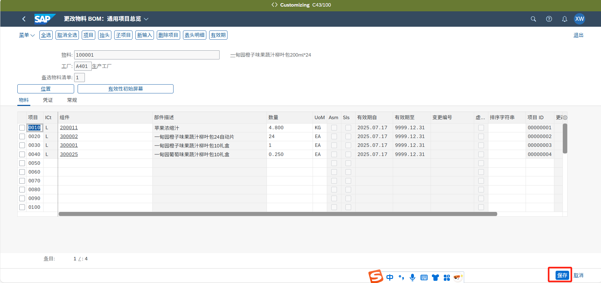
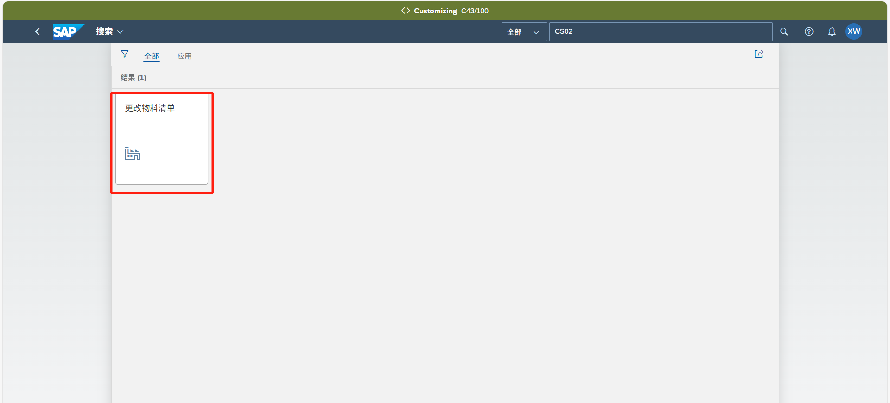
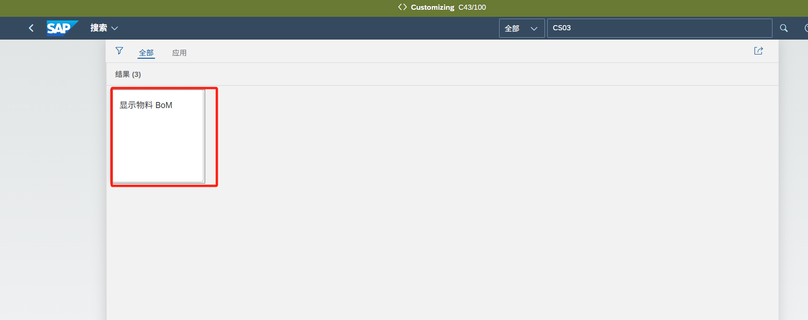

| 文档描述 | 本文档描述SAP系统中的创建BOM主数据的操作描述。 |

## **创建物料清单/CS01**

可以使用APP“创建物料清单”进行BOM创建

物料：BOM的抬头物料编码

工厂：BOM应用的工厂

物料用途：默认1

有效期：BOM的生效日期

回车进入编辑页面

点击抬头先维护抬头数据

抬头基本数量：一般默认为1

在此页面维护BOM组件

ICt（项目类别）固定L

组件：填写BOM子项的物料编码

数量：与抬头基本数量对应比例的用量

单位：填写用量对应的单位

双击行项目可进入单行组件的详细信息页面，维护详细信息

维护完相关信息后点击保存即可

## **更改物料清单/CS02**

使用APP“更改物料清单”可进行BOM修改，后续界面与创建一致

## **显示物料BOM/CS03**

使用APP“显示物料BOM”可进行BOM查看，后续界面与创建一致

