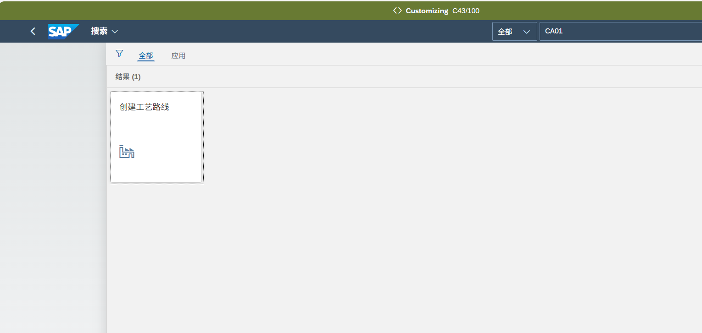
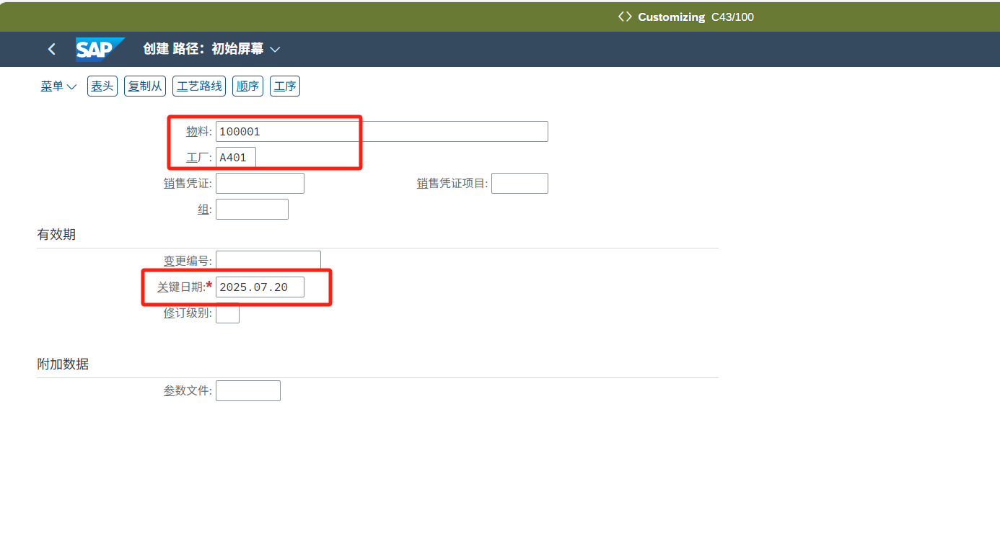
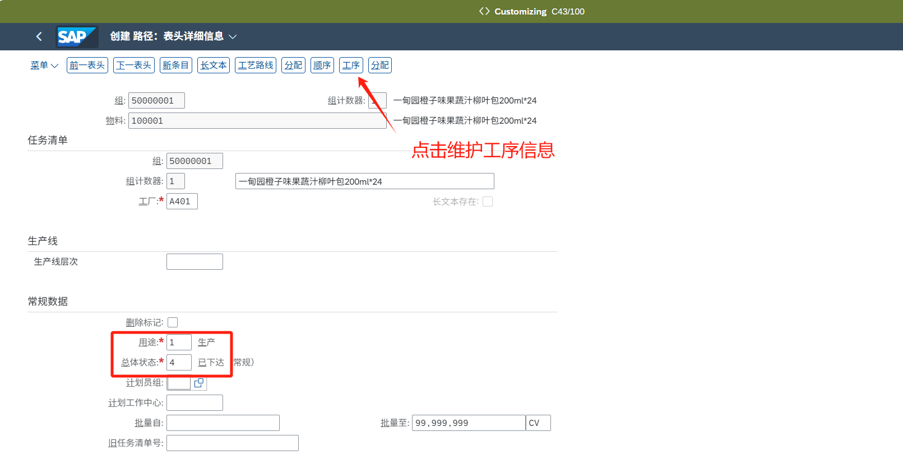
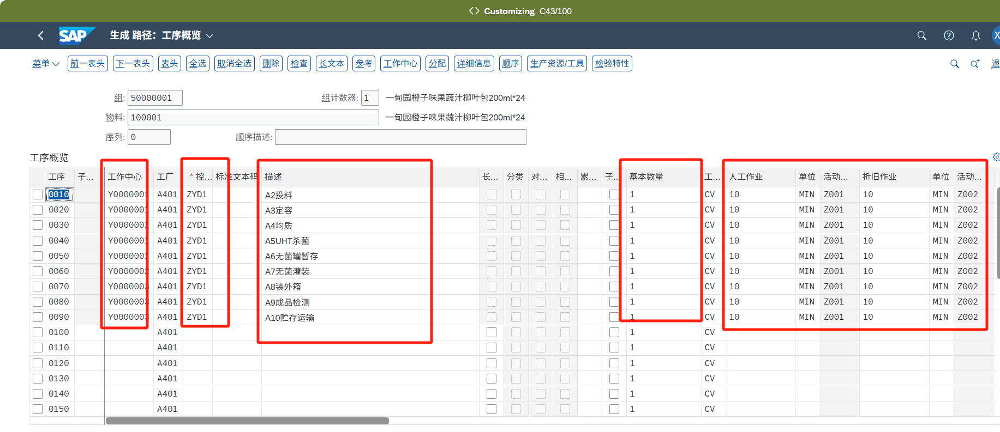
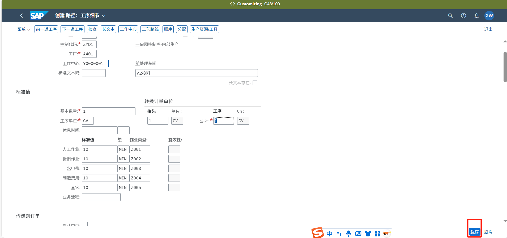
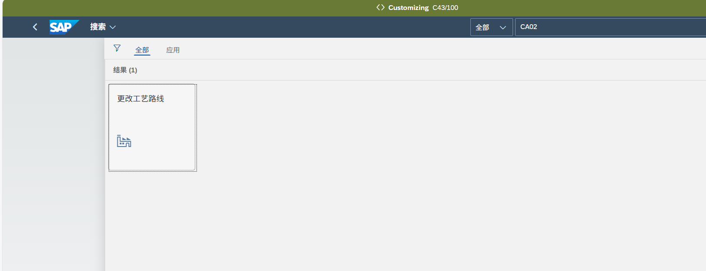
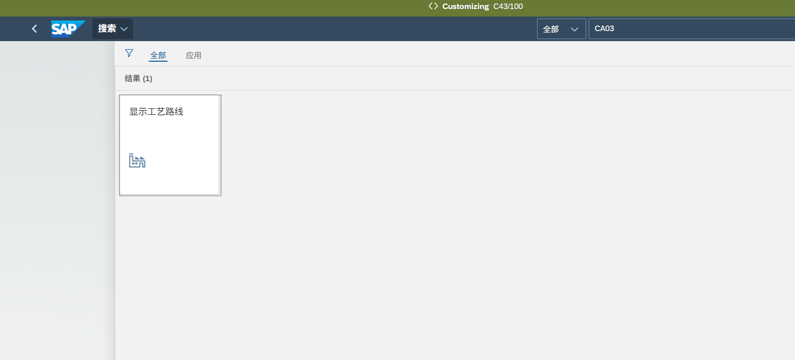

| 文档描述 | 本文档描述SAP系统中的维护工艺主数据的操作描述。 |

## **创建工艺路线/CA01**

可以使用APP“创建工艺路线”进行工艺路线创建

物料：需创建工艺路线的物料编码

工厂：工艺路线应用的工厂

关键日期：工艺路线的生效日期

点击继续进入编辑页面

用途：默认1

总体状态：默认4

然后点击工序按钮维护工序信息

维护工序信息

工作中心：根据工序所在车间选择

Y0000001 前处理车间

Y0000002 灌装车间

Y0000003 包装车间

控制码：默认ZYD1

描述：编辑工序描述

基本数量：与抬头的比例数量

工序计量单位：与抬头的比例数量的单位

人工作业：对应的工时时间

折旧作业：对应的工时时间

水电费：对应的工时时间

制造费用：对应的工时时间

其它：对应的工时时间

工时单位：根据填写时间维护对应单位

双击行项目可进入工序详细信息界面，可在此界面维护工序详细信息

维护完后，点击保存

## **更改工艺路线/CA02**

使用APP“更改工艺路线”可进行工艺路线修改，后续界面与创建一致

## **显示工艺路线/CA03**

使用APP“显示工艺路线”可进行工艺路线查看，后续界面与创建一致

