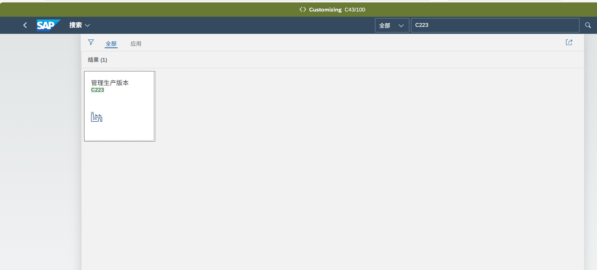
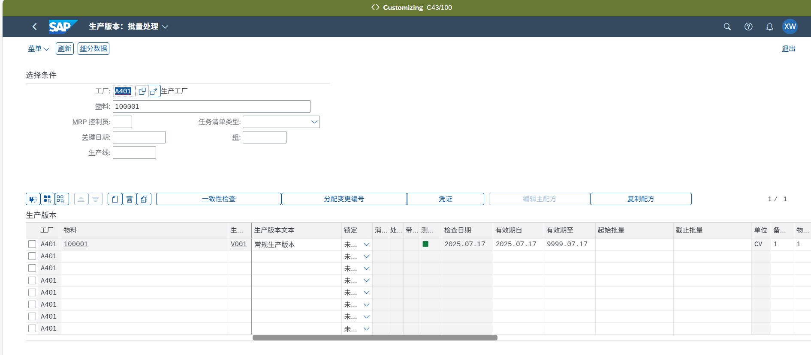
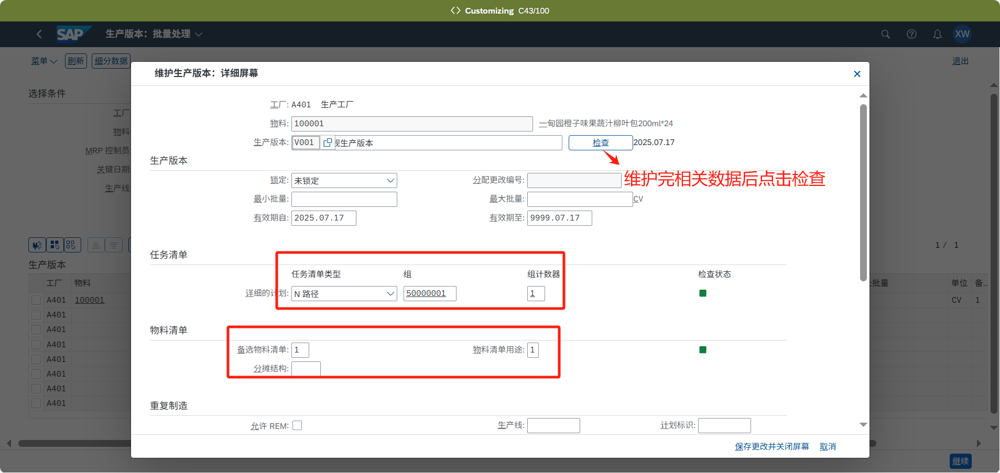
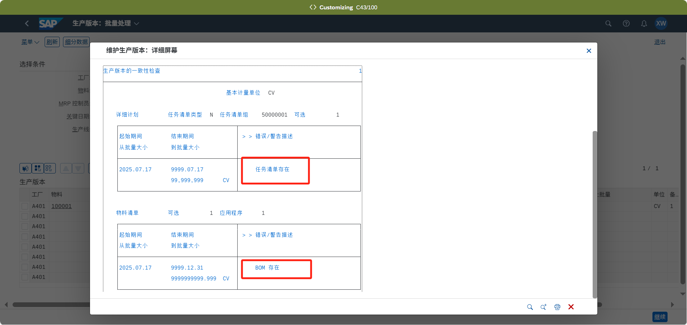
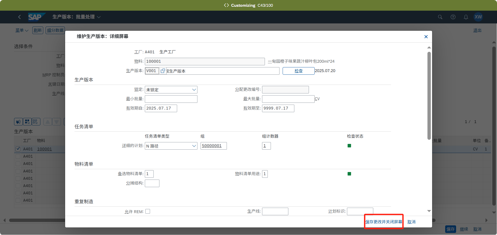
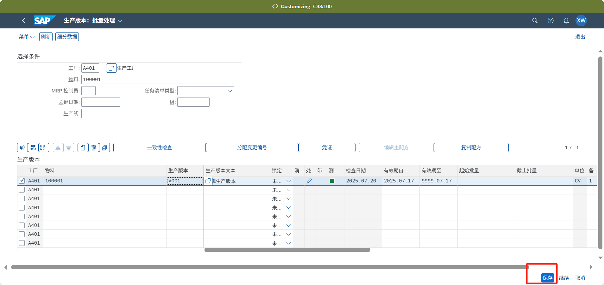

| 文档描述 | 本文档描述SAP系统中的维护生产版本主数据的操作描述。 |

## 方法一：

**管理生产版本/C223**

可以使用APP“管理生产版本”进行生产版本的维护

物料：需创建生产版本的物料编码

工厂：生产版本应用的工厂

生产版本：维护一个版本编号

生产版本文本：维护一个版本描述

有效期自：生产版本有效开始日期

有效期至：生产版本有效截止日期

起始批量：有效起始批量范围

截止批量：有效截止批量范围

双击版本号维护详细信息

任务清单类型：固定选N

组：选择工艺路线的组编码

组计数器：选择工艺路线的组计数器

备选物料清单：选择BOM的版本号

物料清单用途：固定选1

点击检查，提示任务清单存在，BOM存在则没问题，保存即可

!

生产版本的修改和显示都在同一个APP

## 方法二：

也可以使用“处理生产版本”APP，直接按系统建议创建生产版本

查看系统建议的生产版本对应的BOM和工艺数据是否正确，正确的话，可以直接点击接收建议，系统自动创建生产版本