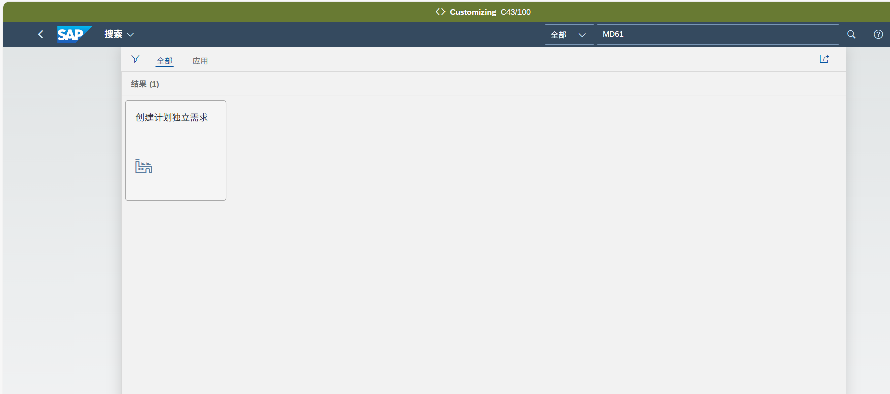
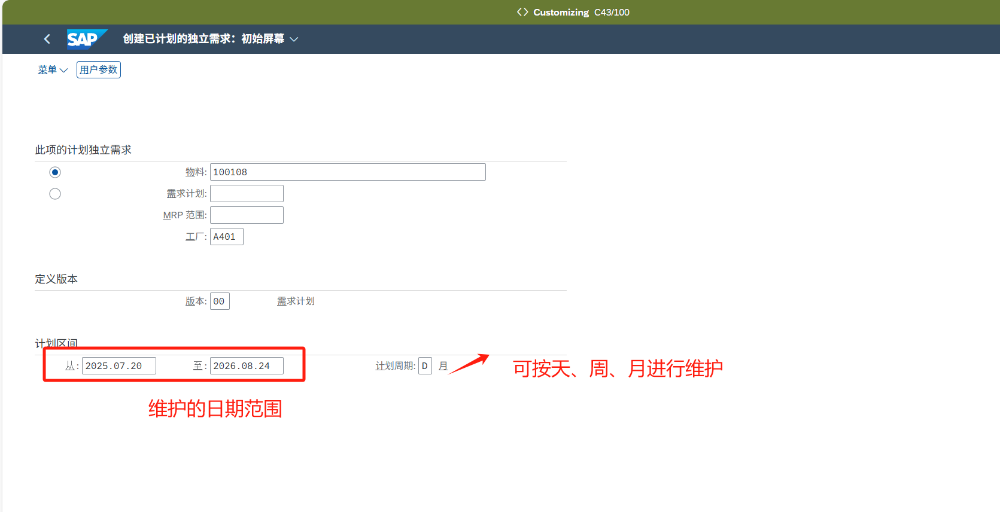
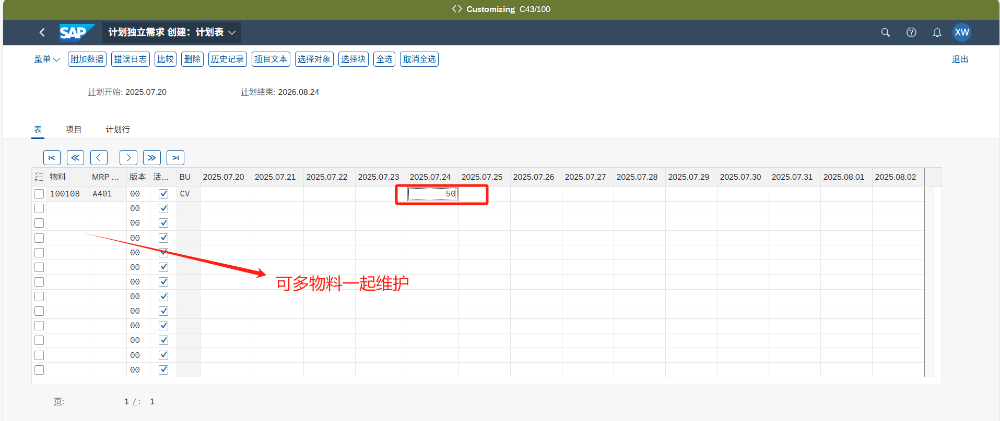
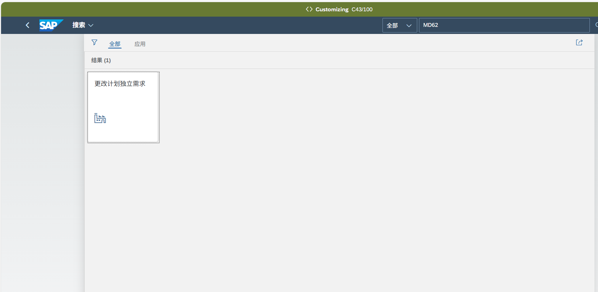
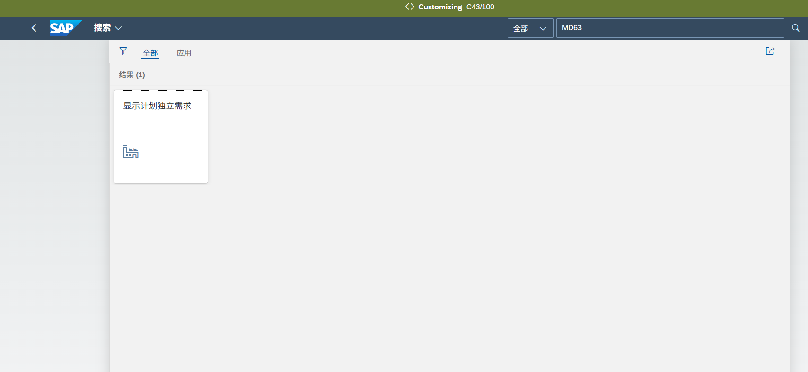

| 文档描述 | 本文档描述SAP系统中的维护生产版本主数据的操作描述。 |

## **创建计划独立需求/MD61**

可以使用APP“创建计划独立需求”进行备货计划的创建

物料：需创建计划独立需求的物料编码

工厂：计划独立需求应用的工厂

按物料维护计划数量，然后保存即可

## **更改计划独立需求/MD62**

操作与创建一样

## **显示计划独立需求/MD63**

操作与创建一样

