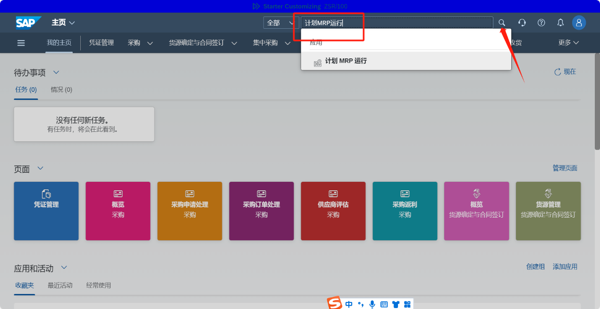
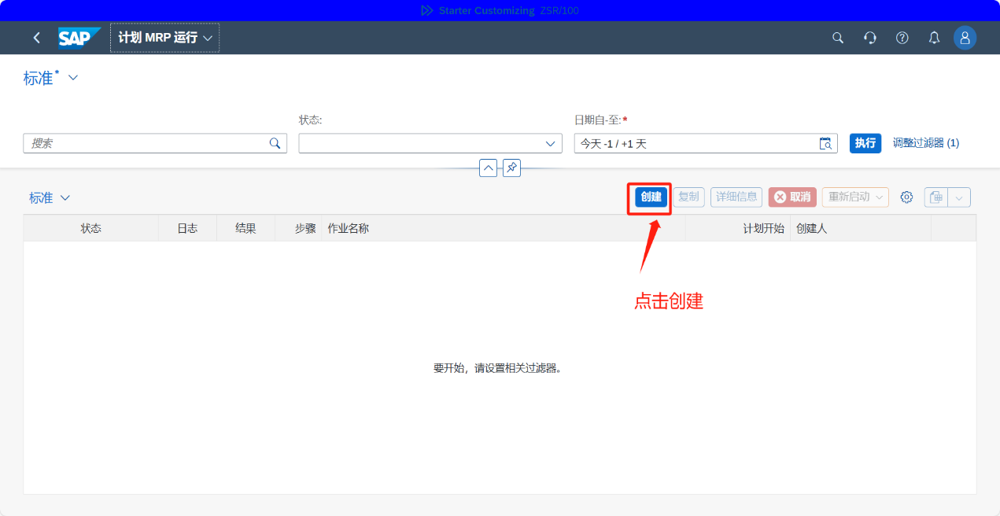
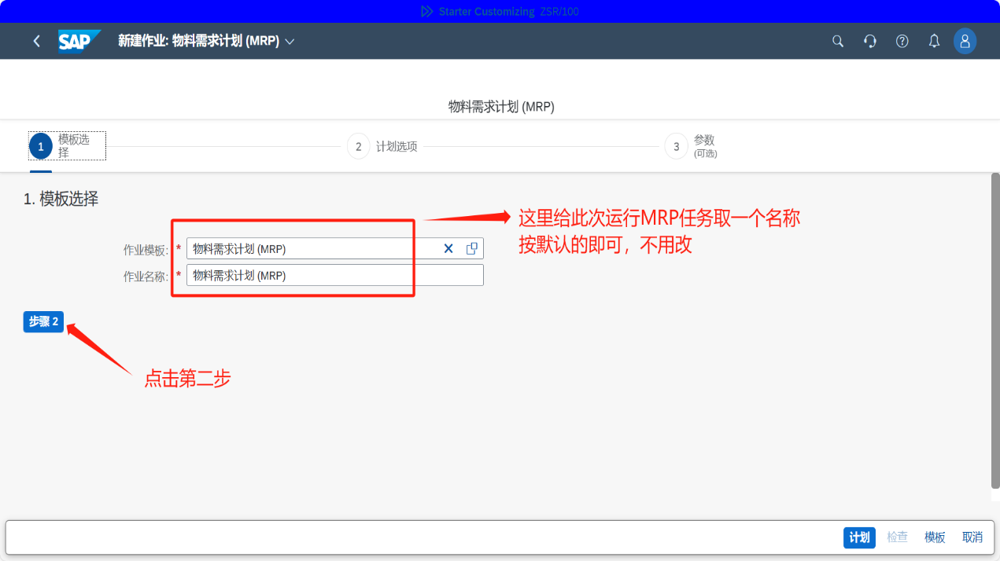
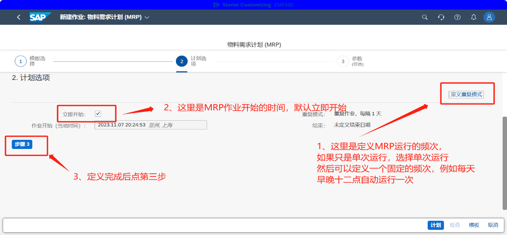
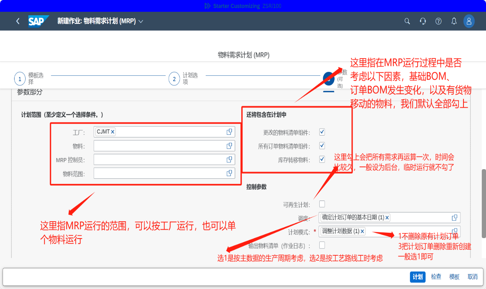
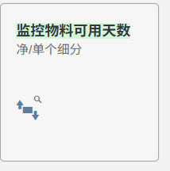
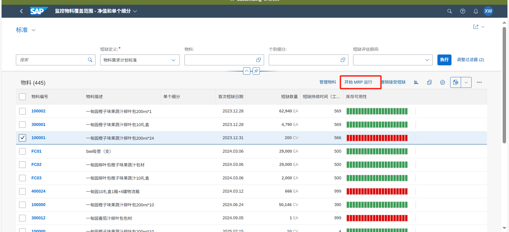
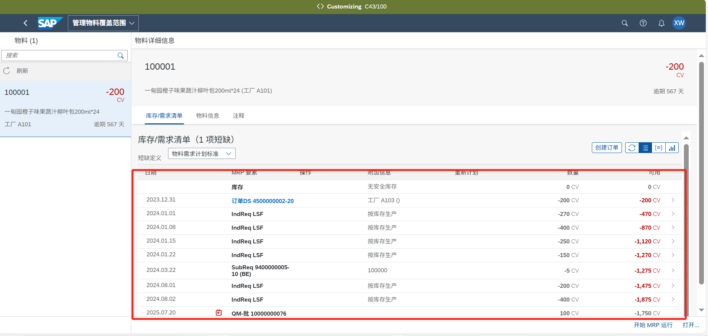

| 文档描述 | 本文档描述SAP系统中的维护生产版本主数据的操作描述。 |

## **计划MRP运行**

可以使用APP“计划MRP运行 ”进行MRP的运行

## **使用“监控物料可用天数 净/单个细分”**

这里也可以按物料运行MRP

此报表主要是用于计划员分析物料的短缺情况，绿色代表供给富余的天数，红色代表物料短缺的天数

点击管理物料可查看物料具体的供需情况

