## 查询采购信息记录

APP: 管理采购信息记录

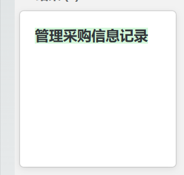

点击，进入管理采购信息记录界面：

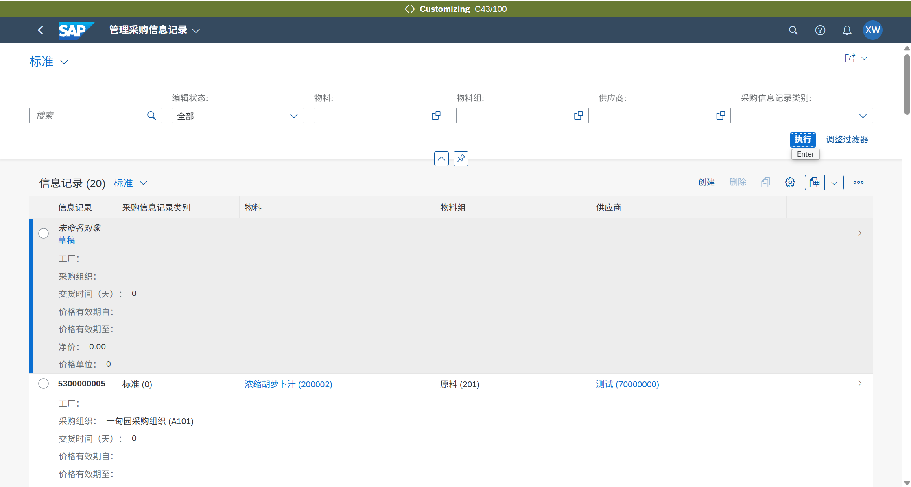

## 创建采购信息记录

创建可以在“管理采购信息记录”页面点击创建，也可以使用APP“创建采购信息记录”。

修改也可以在“管理采购信息记录”点击要修改的采购信息记录进行编辑，也可以使用app”更改采购信息记录”。创建和更改需要填写的字段都是相同的。

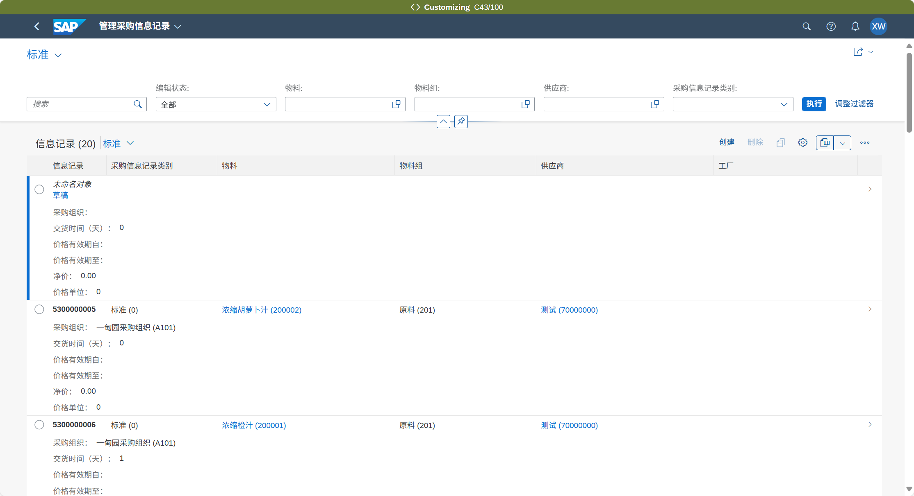

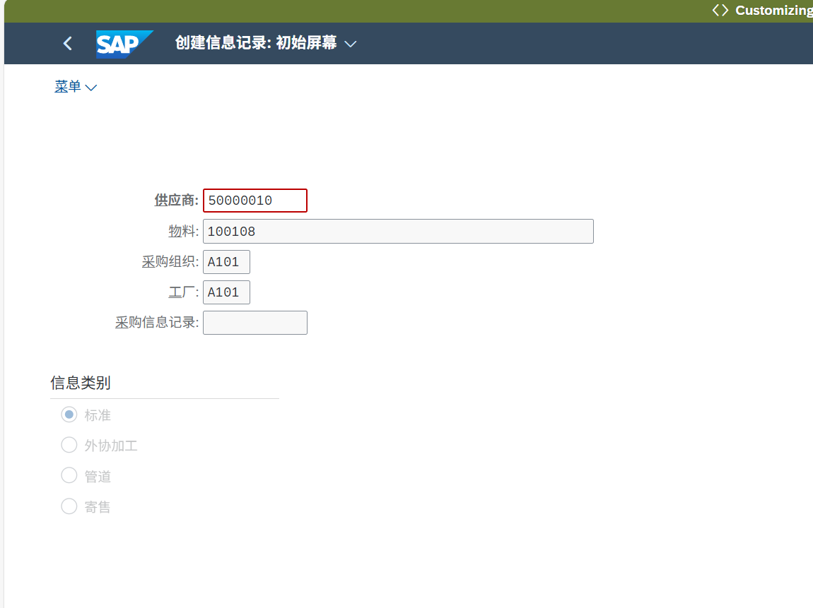

填写完 供应商、物料、采购组织、工厂、信息类别，信息类别如果是标准的采购选“标准”，委外的选“外协加工”。

点击回车，然后点击“采购组织数据1”，

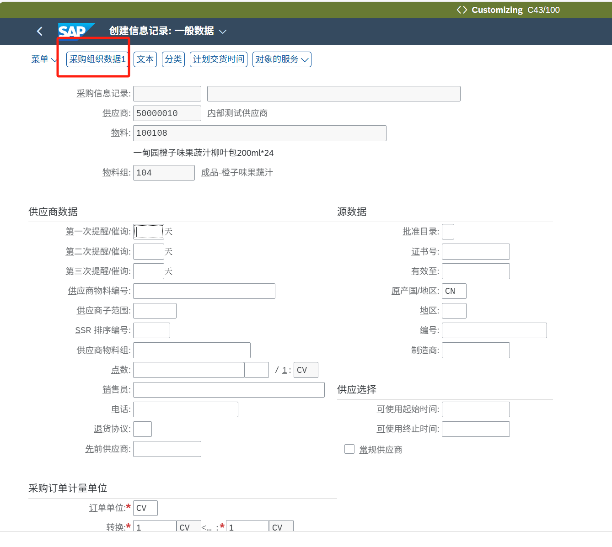

填写字段：

计划交货时间：供应商的送货所需的时间

采购组：负责采购的人员。

标准数量：默认填1

基于收货的发票校验： 默认打勾。

极限不发货：交货不足的容差，填写百分比，数字。选填

极限过度发货：过量交货的容差，填写百分比，数字。选填。

极限不发货和极限过度发货用来控制交货，带到订单上，收货的时候在范围内系统自动为交货已完成打上勾。

净价：价格。

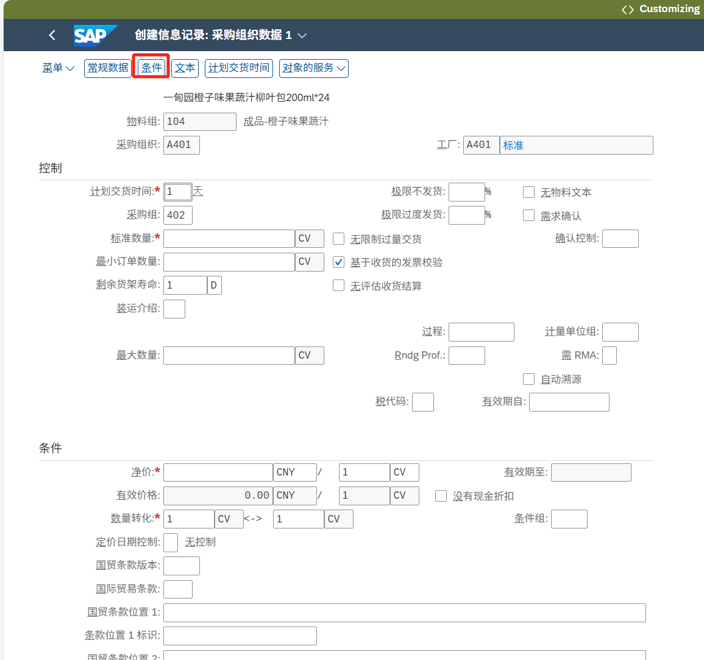

点击，维护有效期。

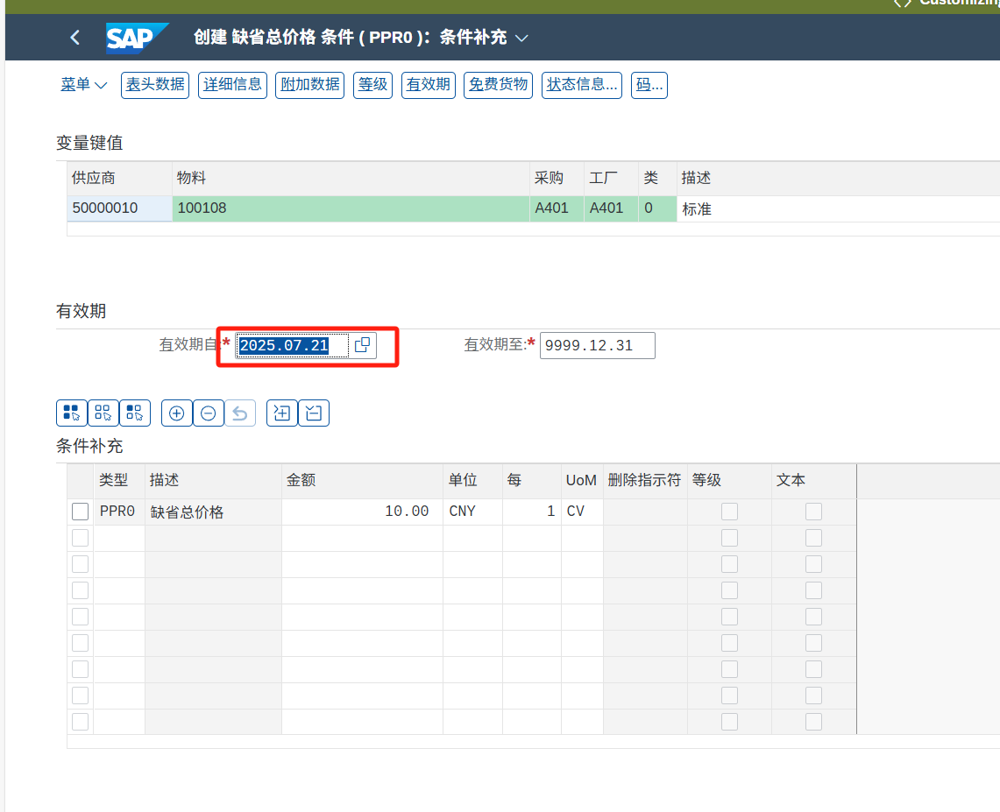

维护完成后，点击右下角“保存”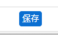按钮保存采购信息记录。采购信息记录创建成功。

## 更改采购信息记录

更改采购信息记录使用的APP,选中点击回车，填写内容和创建时一样，填写 供应商、采购组织、工厂、信息类别，填写完成点击回车。

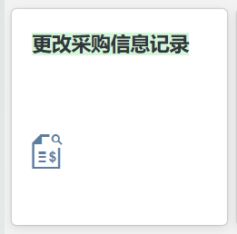

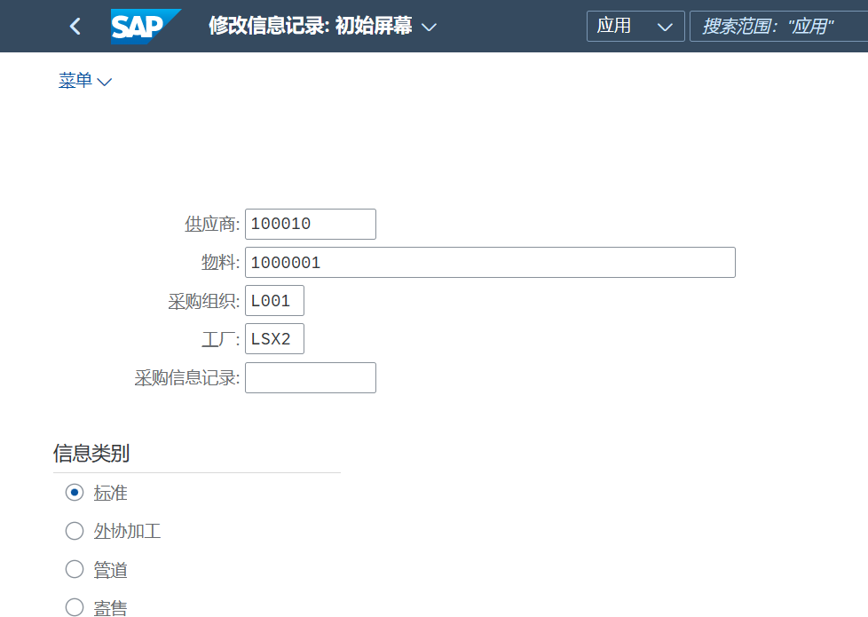

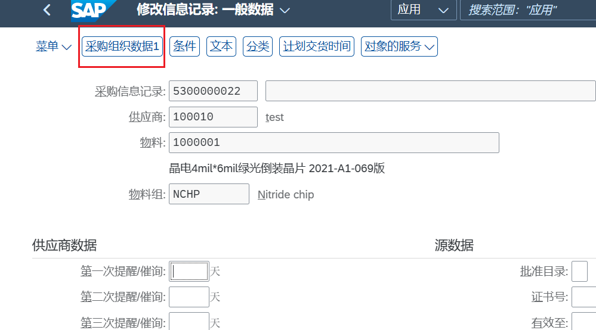

选择“采购组织数据1”，修改需要修改的内容，如果需要修改或新增有效期，点击“条件”，

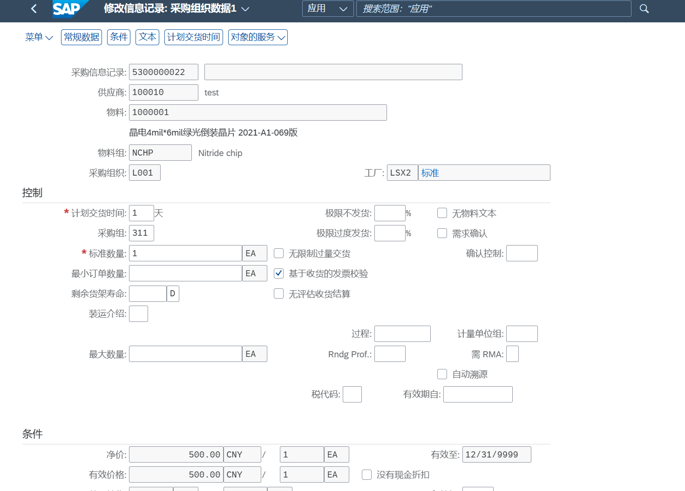

点击条件会弹出一个框，可以选择指定有效期，修改指定的有效期内的价格，或者点击“新的有效期”增加一个新的有效期。这两个的界面是一样的。
这里以创建新的有效期为例：填写有效期自和有效期至以及价格，填写完毕，点击右下角的“保存”按钮即可保存。

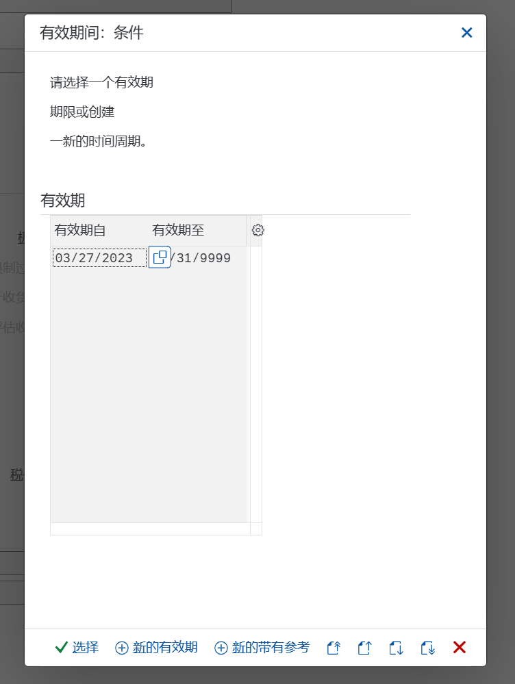

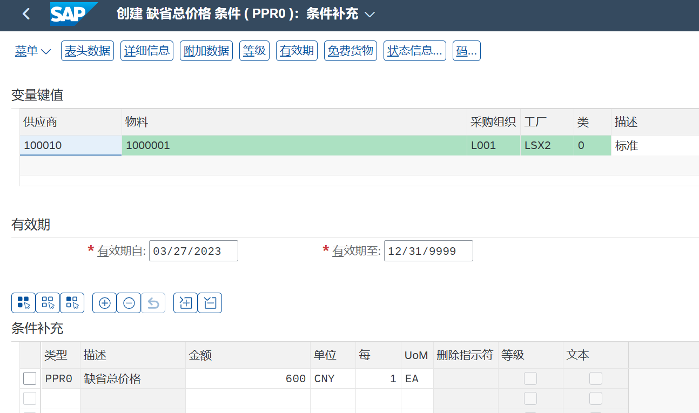