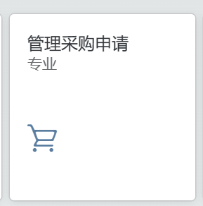
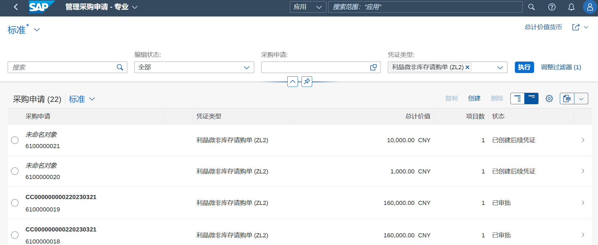
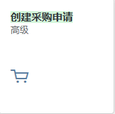
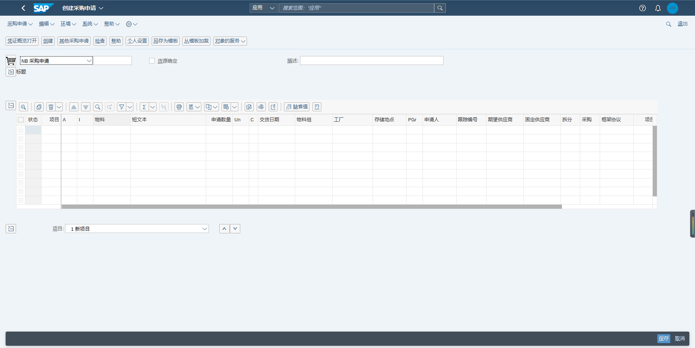
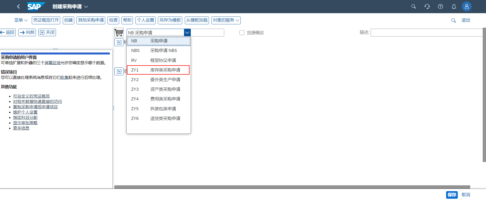
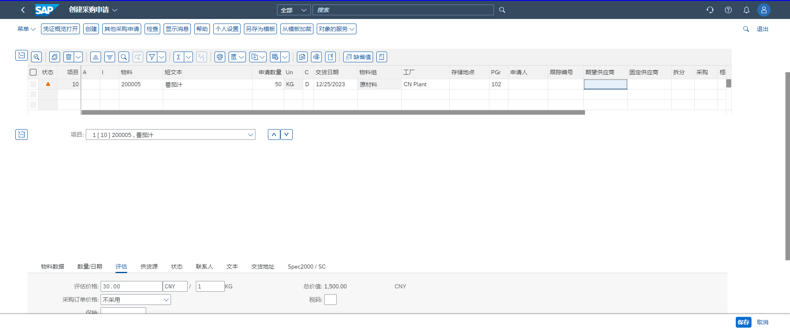
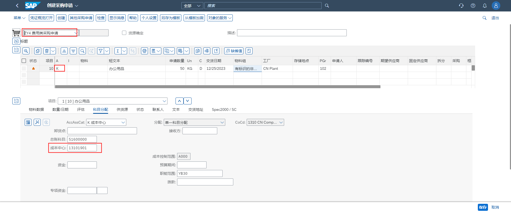
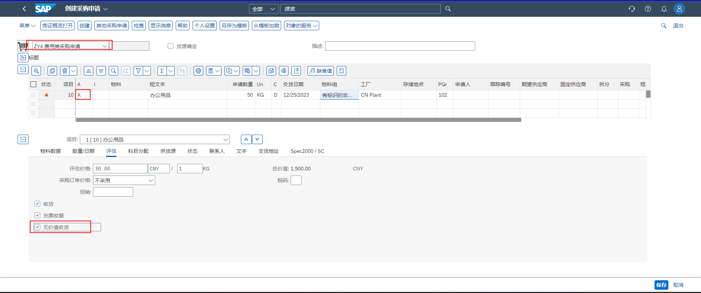
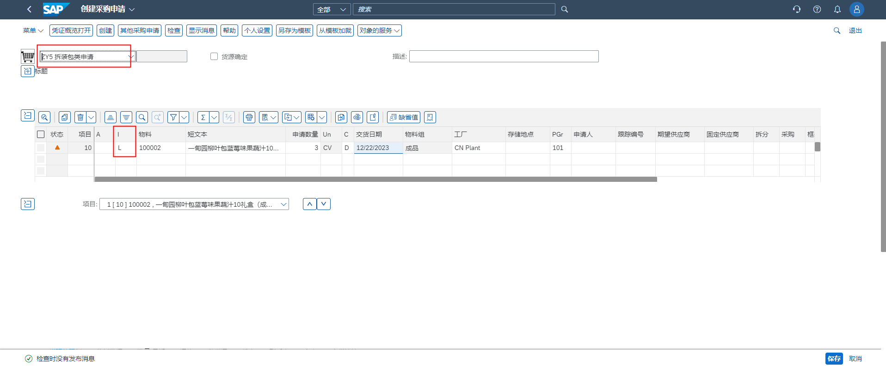

## 查询采购申请

使用APP“管理采购申请”可以查询过滤采购申请。

## 创建采购申请

APP: 创建采购申请

点击，进入创建采购申请界面:

创建可以在APP“创建采购申请-高级”页面点击创建，也可以使用APP“管理采购申请”创建。

修改可以创建“采购申请-高级”找到采购申请订单，点击显示/更改进行编辑，也可以在“管理采购申请”点击要修改的采购申请记录进行编辑。

创建和更改需要填写的字段都是相同的。

### 创建库存类采购申请

选择采购类型

项目概览填写：物料、申请数量、交货日期、采购组织（选填）、工厂、采购组

项目细节填写：评估价格（评估价格会自动带出物料主数据上的价格，如果没有需要手动填写评估价格）。点击最上方的检查，提示没有问题保存即可。

### 创建非库存类采购申请（费用）

选择采购类型

项目概览填写: 科目分配选K、短文本、申请数量、单位、交货日期、物料组、工厂、采购组织（选填）、采购组

项目细节填写：评估价格、成本中心，点击检查，提示没有问题保存即可。

费用性采购注意：一定要勾选 无价值收货。

### 创建拆装包类型采购申请

选择采购类型

项目概览填写：项目类别L、物料、申请数量、交货日期、采购组织（选填）、工厂，点击检查，提示没有问题保存即可。